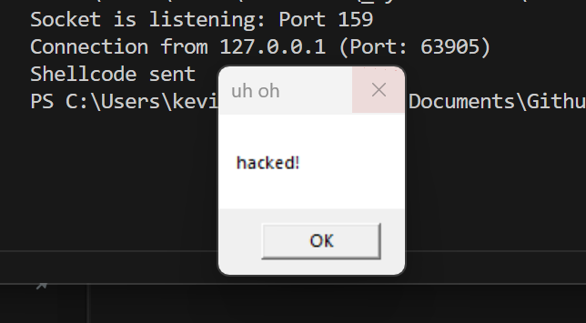

# Shellcode Downloader
Project I made for educational purposes. This C executable downloads custom shellcode from a Python server, which displays the message box "hacked!".

The build uses ConfigMaker.py to automatically set the encryption keys and C2 details in both the compiled C binary and the server's configuration.

## How to build
**1.** Modify `resources/config.json` as desired.

**2.** Build the config via `py build_scripts/ConfigMaker.py`.

**3.** Build the solution via `src/dowloader/VS_Project/Downloader.sln`.

**4.** Run the server via `py build_scripts/Server.py`.
